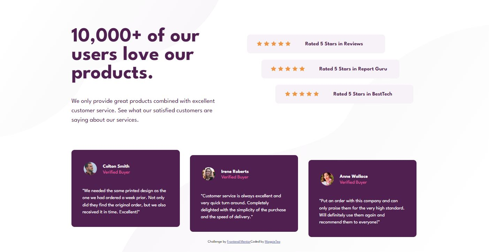

# Frontend Mentor - Social proof section solution

This is a solution to the [Social proof section challenge on Frontend Mentor](https://www.frontendmentor.io/challenges/social-proof-section-6e0qTv_bA). Frontend Mentor challenges help you improve your coding skills by building realistic projects. 

## Table of contents

- [Overview](#overview)
  - [The challenge](#the-challenge)
  - [Screenshot](#screenshot)
  - [Links](#links)
- [My process](#my-process)
  - [Built with](#built-with)
  - [What I learned](#what-i-learned)
  - [Continued development](#continued-development)
  - [Useful resources](#useful-resources)
- [Author](#author)
- [Acknowledgments](#acknowledgments)


## Overview

### The challenge

Users should be able to:

- View the optimal layout for the section depending on their device's screen size

### Screenshot




### Links

- Solution URL: (https://github.com/MagpieTea/SocialProofPage.git)
- Live Site URL: (https://magpietea.github.io/SocialProofPage/)

## My process
  Since this project involved many more sections than any I have previously worked with, I started by using color-blocking to create the right layout. Once I had the right flow, I started entering the content where it belonged and styling it. It took me roughly 6 hours to complete start to finish, which is significantly faster than my last flex-box based challenge.

  I used grid to create the off-set star-rating boxes, because it allowed me to set their position more easily than flexbox did. Most divs were flex-box based since that allowed me the most flexibility (pun!) with positioning.
  
### Built with

- Semantic HTML5 markup (sort of; still working on proper semantics!)
- CSS custom properties
- Flexbox
- CSS Grid
- Mobile-first workflow


### What I learned

I used css grid for the first time in this project, albeit in a small way. I also really connected the dots on the difference between justify content, justify items and justify self. I learned about using background to repeat an image (though I didn't end up doing that for the stars). 


I'm proud of this html because I really leaned in to divs. I used more layers than I have before. I also worked with assigning classes and id's to items to target them for different purposes.
```html
 <div class="ratings"> 
          <div class="rating-box" id="rating-1">
            <div class="stars"> 
```

I'm proud of this css because it's the first time I've used grid, and I loved how easily I could position my ratings boxes using it. I realized that if I made my ratings-boxes responsive to the viewport width that I could keep these three spread out in the same staggered pattern, but have them scale in or out based on the viewport, using this method.
```css
.ratings{
  display: grid;
  width: 50%;
  margin: 5% auto auto auto;
}
#rating-1{
  justify-self: start;
}
#rating-2{
  justify-self: center;
}
#rating-3{
  justify-self: end;
}
```

### Continued development

Now that I have dipped my toe into css grid, I'd like to go all-out and figure out how to apply it in more complex ways, using the full long-hand layout.

### Useful resources

I primarily used mdn and w3schools for documentation on css properties.

## Author

- Website - [Margaret Thurman](https://magpietea.github.io/cv/)
- Frontend Mentor - [@MagpieTea](https://www.frontendmentor.io/profile/MagpieTea)


## Acknowledgments

Shout out to my partner on this journey toward development, my best friend and husband [NeonGliiitch](https://github.com/neonGliiitch)
